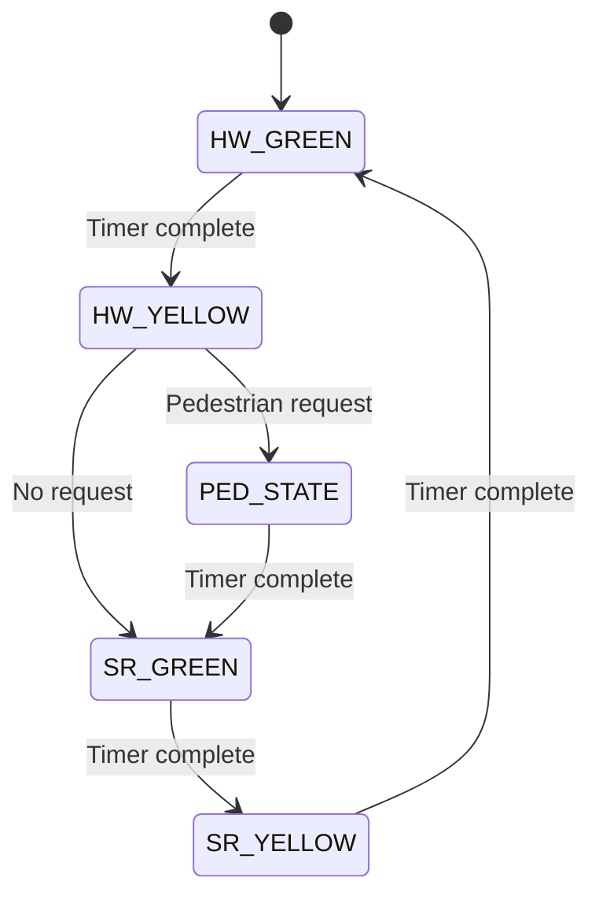
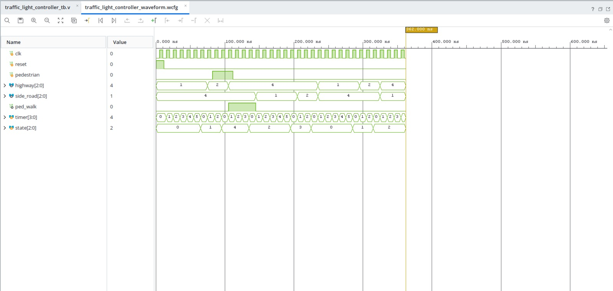
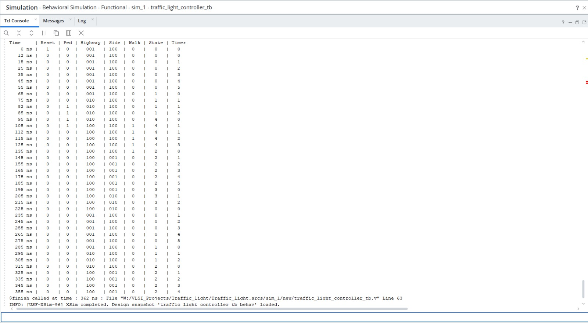
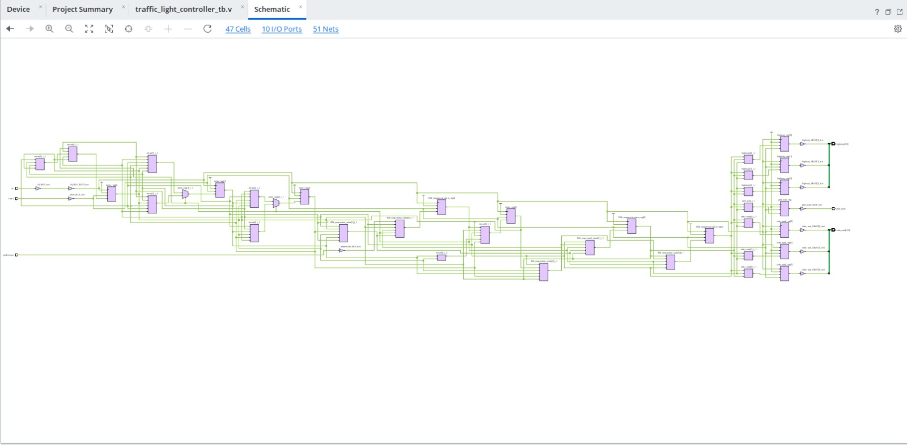
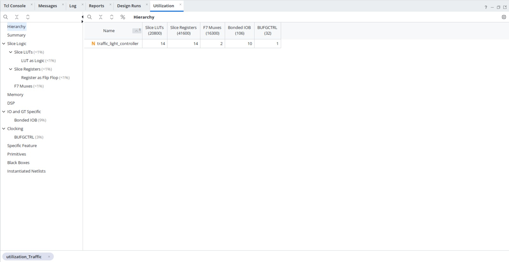
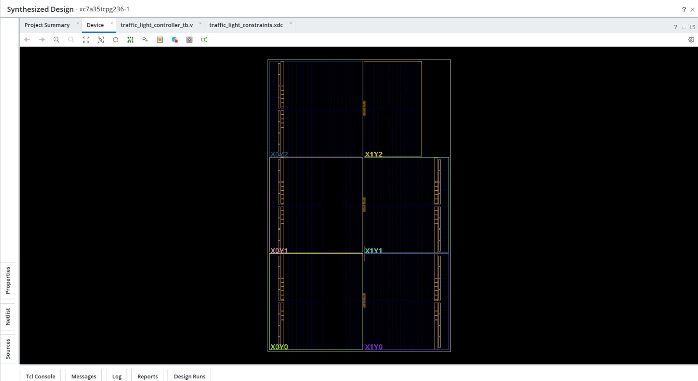
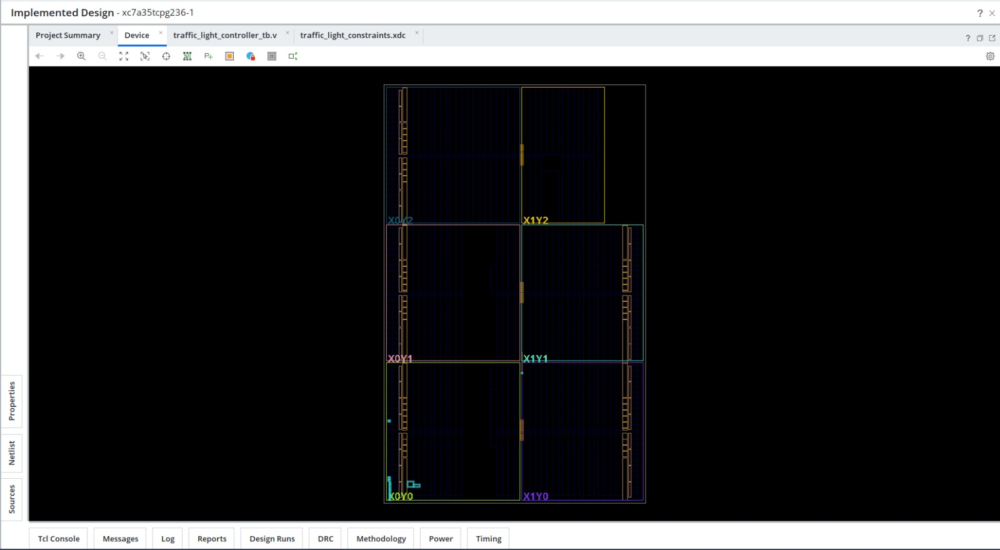
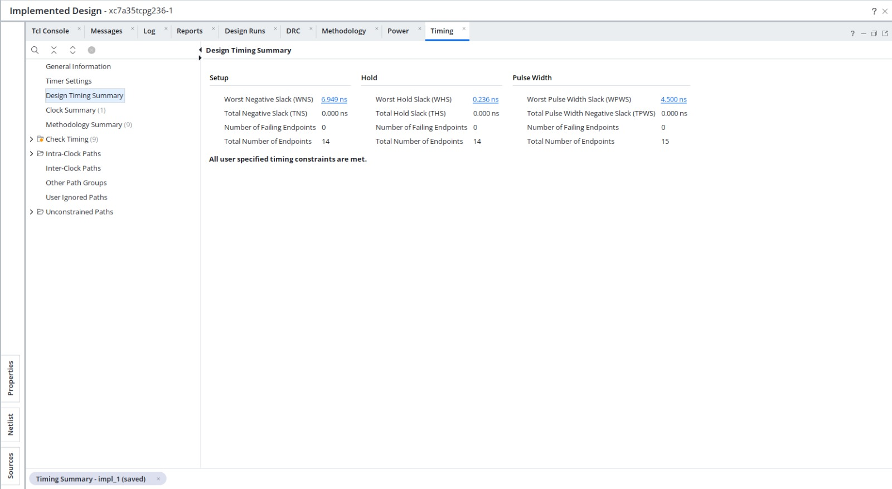
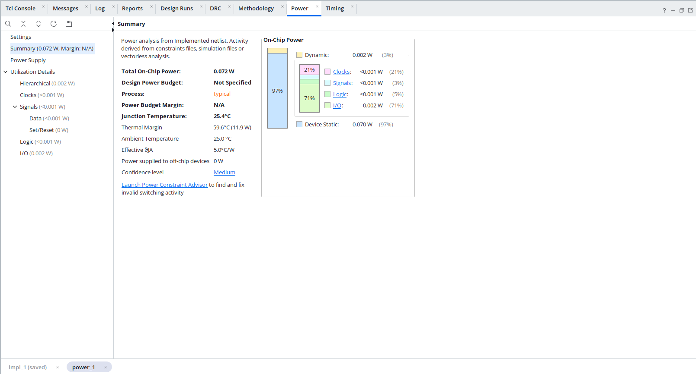

# Traffic Light Controller with Pedestrian Crossing

This is my first full-fledged RTL project.

A synthesizable Verilog HDL traffic controller implemented as a five-state finite state machine (FSM). The design controls highway traffic, side-road traffic, and a pedestrian crossing while enforcing safe signal transitions.

The project was simulated, synthesized, and implemented in AMD Vivado 2026.1 for the Xilinx Artix-7 `xc7a35tcpg236-1` FPGA.

## Key Features

- Five-state Moore-style FSM
- Separate green and yellow phases for both roads
- Pedestrian crossing only while both roads are red
- Timer-controlled state transitions
- Asynchronous active-high reset
- Safe recovery from an invalid state
- 100 MHz timing constraint
- Behavioral simulation, synthesis, implementation, timing, and power analysis

## System Interface

| Signal | Direction | Width | Description |
|---|---:|---:|---|
| `clk` | Input | 1 bit | System clock |
| `reset` | Input | 1 bit | Asynchronous active-high reset |
| `pedestrian` | Input | 1 bit | Pedestrian crossing request |
| `highway` | Output | 3 bits | Highway red, yellow, and green lights |
| `side_road` | Output | 3 bits | Side-road red, yellow, and green lights |
| `ped_walk` | Output | 1 bit | Pedestrian walk indication |

### Light Encoding

| Value | Light |
|---:|---|
| `3'b100` | Red |
| `3'b010` | Yellow |
| `3'b001` | Green |

## FSM Design

| State | Encoding | Highway | Side Road | Pedestrian | Duration |
|---|---:|---|---|---|---:|
| `hw_green` | `3'b000` | Green | Red | Stop | 6 clock cycles |
| `hw_yellow` | `3'b001` | Yellow | Red | Stop | 3 clock cycles |
| `ped_state` | `3'b100` | Red | Red | Walk | 4 clock cycles |
| `sr_green` | `3'b010` | Red | Green | Stop | 6 clock cycles |
| `sr_yellow` | `3'b011` | Red | Yellow | Stop | 3 clock cycles |



The dedicated `sr_yellow` state improves safety compared with a basic implementation that changes directly from side-road green to highway green.

## Verification

The testbench generates a 100 MHz clock, applies reset, submits a pedestrian request, and allows the controller to complete requested and non-requested traffic sequences. Internal `state` and `timer` signals are included in the simulation output to verify each transition.





## Synthesis Results

Vivado synthesized the RTL into 47 hardware cells connected by 51 nets.



| Resource | Used |
|---|---:|
| Slice LUTs | 14 |
| Slice registers | 14 |
| F7 multiplexers | 2 |
| Bonded I/O blocks | 10 |
| Global clock buffers | 1 |



## Implementation

The design was placed and routed on the selected Artix-7 target.





## Timing Analysis

A 10 ns clock constraint was applied, corresponding to 100 MHz. Post-implementation timing analysis reported no setup or hold violations.

| Metric | Result |
|---|---:|
| Worst Negative Slack | `+6.949 ns` |
| Total Negative Slack | `0.000 ns` |
| Worst Hold Slack | `+0.236 ns` |
| Total Hold Slack | `0.000 ns` |
| Failing endpoints | `0` |



## Power Analysis

Vivado estimated 72 mW of total on-chip power. The estimate has medium confidence and is based on vectorless switching activity, so it represents an implementation estimate rather than a physical board measurement.

| Metric | Result |
|---|---:|
| Total on-chip power | `0.072 W` |
| Dynamic power | `0.002 W` |
| Device static power | `0.070 W` |
| Junction temperature | `25.4 C` |



## Repository Structure

```text
traffic-light-controller-verilog/
|-- traffic_light_controller.v
|-- traffic_light_controller_tb.v
|-- traffic_light_constraints.xdc
|-- images/
|   |-- behavioral-simulation-waveform.jpeg
|   |-- simulation-console-output.jpeg
|   |-- synthesized-hardware-schematic.jpeg
|   |-- fpga-resource-utilization.jpeg
|   |-- synthesized-fpga-device-view.jpeg
|   |-- implemented-fpga-device-view.jpeg
|   |-- post-implementation-timing-summary.jpeg
|   `-- post-implementation-power-analysis.jpeg
|-- README.md
`-- LICENSE
```

## Running the Project in Vivado

1. Create a new RTL project in AMD Vivado.
2. Select the Artix-7 part `xc7a35tcpg236-1`.
3. Add `traffic_light_controller.v` as a design source.
4. Add `traffic_light_controller_tb.v` as a simulation source.
5. Add `traffic_light_constraints.xdc` as a constraint source.
6. Set `traffic_light_controller_tb` as the simulation top.
7. Run Behavioral Simulation.
8. Run Synthesis and Implementation to reproduce the reports.

## Current Limitations and Future Work

- Latch short pedestrian requests so they cannot be missed before the sampling point.
- Add an all-red safety interval between traffic directions.
- Add a side-road vehicle sensor for adaptive operation.
- Replace simulation-scale counters with configurable real-time durations.
- Add SystemVerilog assertions for automatic safety checking.

## Author

Devaananth
